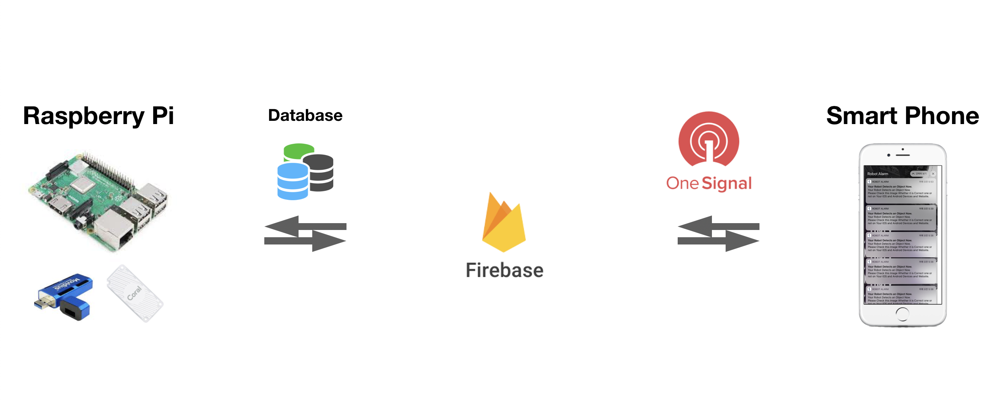
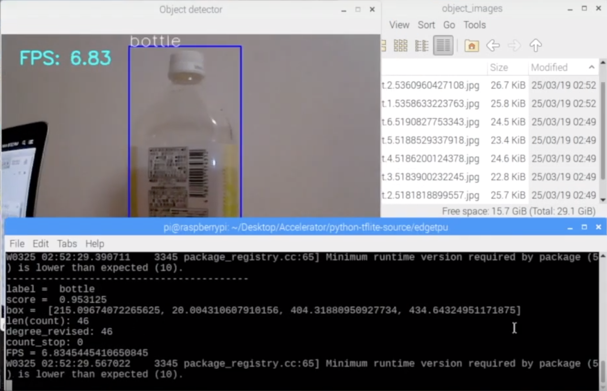
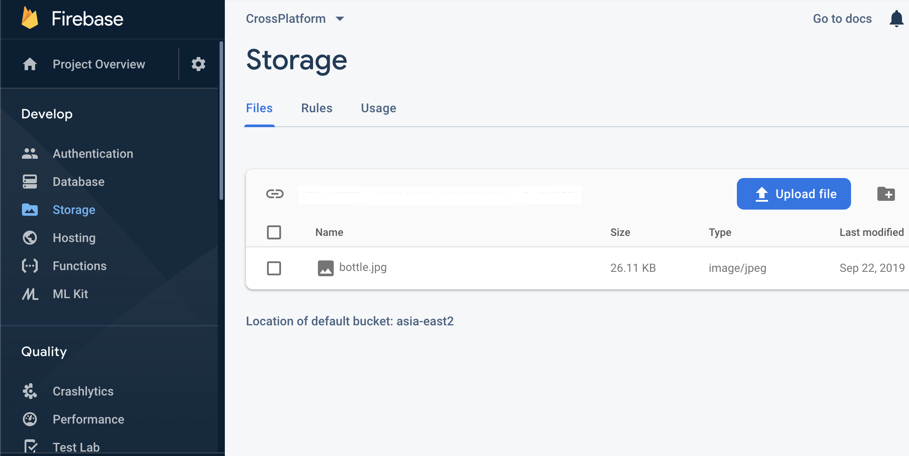
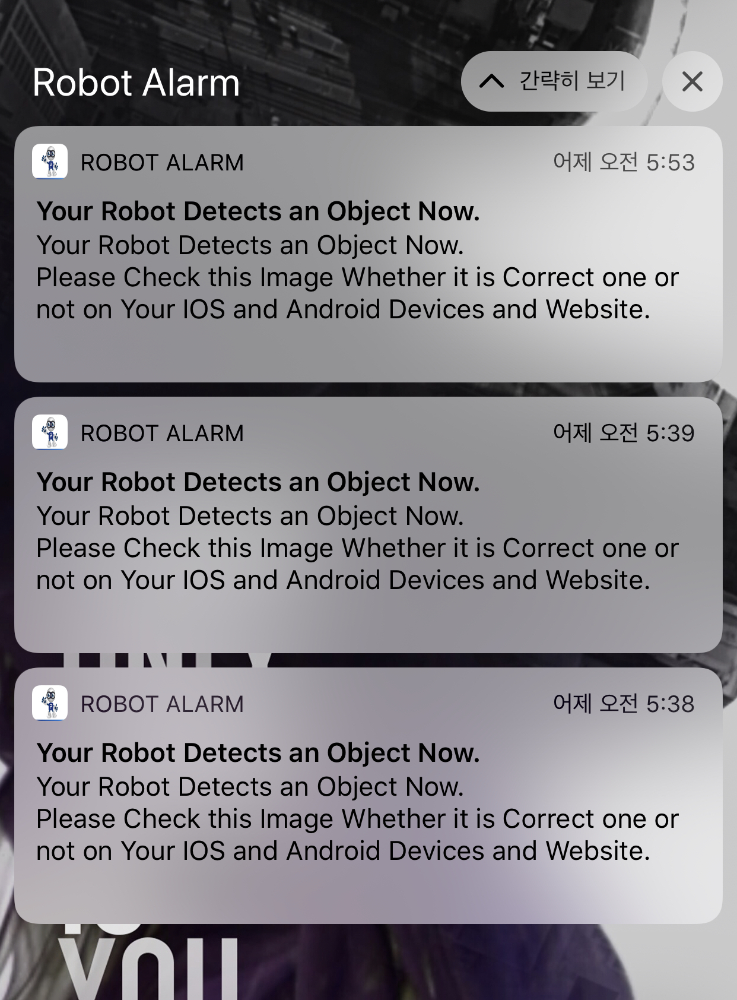

# AI-Realtime-Image-Recognition-and-command

# Detection of Specific Object on Raspberry Pi
- Based on your model to detect a specific object in which you want to get the result, the database is sent to Firebase.

# Notification on Your Smartphone or Device or Website
- If Firebase has the database on the specific location which has been selected, Firebase triggers Onesignal and then your smartphone, device or website have a notification of information.

# Command by Your Smartphone or Device or Website
- The command which you send to Firebase is taken by the robot immediately.

# AI-Realtime-Image-Recognition-and-Notification
